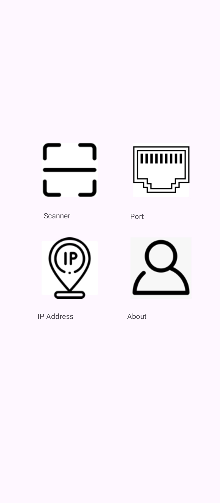
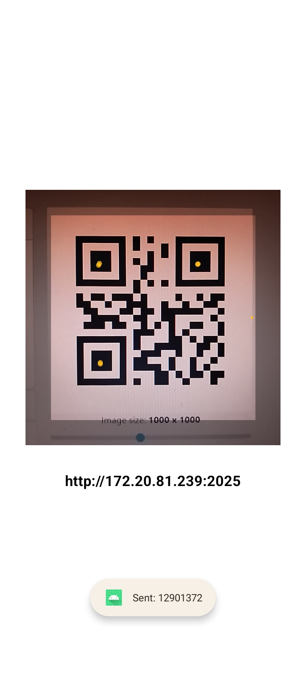
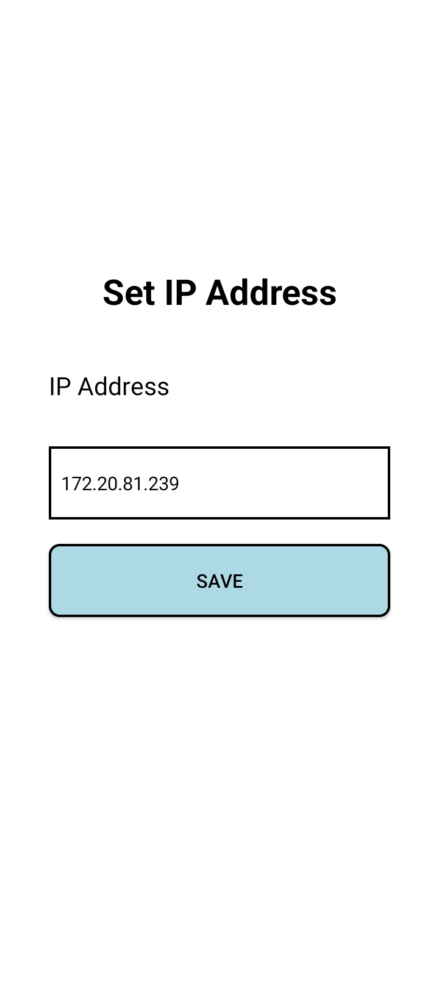
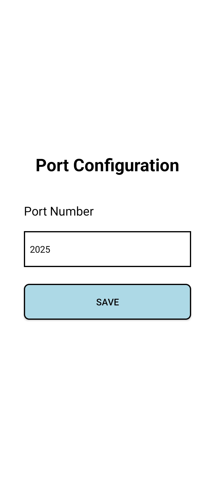
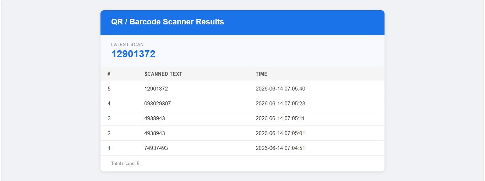

<div>

# QR Code / Barcode Scanner with Web Server Integration


*A system for scanning text from QR codes or barcodes using a smartphone and sending it to the cursor (server) on a computer.*

</div>

---

## 📱 Mobile Interfaces

<div>
<table border="0" style="border: none; border-collapse: collapse;">
  <tr>
    <td align="center" style="border: none; padding: 8px;">
      
      <br/>
      <sub>🏠 Home Screen</sub>
    </td>
    <td align="center" style="border: none; padding: 8px;">
      
      <br/>
      <sub>📷 Scanner</sub>
    </td>
    <td align="center" style="border: none; padding: 8px;">
      
      <br/>
      <sub>🌐 IP Address Setup</sub>
    </td>
    <td align="center" style="border: none; padding: 8px;">
      
      <br/>
      <sub>🔌 Port Setup</sub>
    </td>
    <td align="center" style="border: none; padding: 8px;">
      
      <br/>
      <sub>ℹ️ About</sub>
    </td>
  </tr>
  <tr>
    <td align="center" style="border: none; padding: 8px;">
      <sub>Homepage with buttons for scanner, port, IP address, and about.</sub>
    </td>
    <td align="center" style="border: none; padding: 8px;">
      <sub>Scans QR/Barcode and sends result to web cursor with a 3000ms delay.</sub>
    </td>
    <td align="center" style="border: none; padding: 8px;">
      <sub>Set the IP address to connect to the web cursor.</sub>
    </td>
    <td align="center" style="border: none; padding: 8px;">
      <sub>Default port number is <code>2025</code>.</sub>
    </td>
    <td align="center" style="border: none; padding: 8px;">
      <sub>Shows the description of the competition.</sub>
    </td>
  </tr>
</table>
</div>

---

## 🖥️ Server Side

<div>
<table border="0" style="border: none; border-collapse: collapse;">
  <tr>
    <td align="center" style="border: none; padding: 8px;">
      
      <br/>
      <sub>🌐 Web Cursor — API Side</sub>
    </td>
  </tr>
  <tr>
    <td align="center" style="border: none; padding: 8px;">
      <sub>Waits for a connection from the mobile. Receives and displays the scanned QR Code / Barcode text.</sub>
    </td>
  </tr>
</table>
</div>

---

## 🛠️ Tech Stack

<div>


</div>

---

## ⚙️ Key Features

**🏠 Clean Home Interface**
> Homepage consists of quick-access buttons for the scanner, port configuration, IP address setup, and about section.

**📷 QR / Barcode Scanner**
> Scans QR codes and barcodes via smartphone camera and sends the result to the web cursor over IP and port connection with a 3000ms transmission delay.

**🌐 IP Address Configuration**
> Manually set the target IP address to establish connection with the web cursor server.

**🔌 Port Configuration**
> Configurable port number with a default value of `2025`.

**🖥️ Web Cursor (Server Side)**
> API endpoint that listens for incoming mobile connections and displays the scanned QR Code / Barcode text in real time.

---

## 🚀 How to Run

**1. Activate the server**
> Navigate to: `QRcode-Barcode-Scanner → server`
```
python server.py
```
> Copy the running address shown in the terminal.

**2. Get your IP Address**
```
ipconfig
```
> Copy the **IPv4 Address** and input it in the mobile app under the IP Address section.

**3. Open Android Studio**
> Run the application on an emulator or physical device.

**4. Enjoy! 🎉**

---

## 🔑 Connection Details

| Setting | Value |
|---|---|
| Default Port | `2025` |
| Server Command | `python server.py` |
| IP Source | `ipconfig` → IPv4 Address |

<div align="center">

</div>
